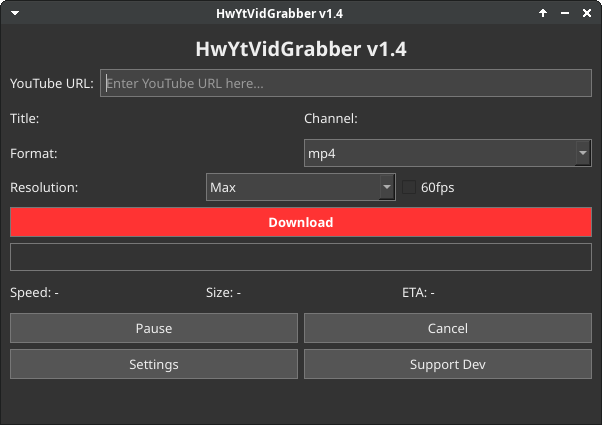

# HwYtVidGrabber



A simple, efficient YouTube video and audio downloader with an intuitive GUI built with PyQt6.

## Features

- Download YouTube videos in various resolutions (144p to 4K)
- Extract audio as MP3
- Option for 60fps videos when available
- Download videos without audio (muted mp4)
- Pause, resume, and cancel downloads
- Dark mode support
- Progress tracking with speed, file size, and ETA indicators
- Auto-detection of maximum available resolution
- Customizable download location

## Requirements (only for building)

- Python 3.8+
- FFmpeg (automatically detected, with installation guidance)
- PyQt6
- yt-dlp

## Portable version

the app is already portable, but if you want to install it:

## Installation


### Windows

```batch
git clone https://github.com/MalikHw/HwYtVidGrabber.git
cd HwYtVidGrabber
```
OR COPY THE REPO
download `HwYtVidGrabber.exe` from [releases](https://github.com/MalikHw/HwYtVidGrabber/releases/) and copy it to the newly made folder, after that
```batch
install.bat
```

### Linux

```bash
git clone https://github.com/MalikHw/HwYtVidGrabber.git
cd HwYtVidGrabber
```
OR COPY THE REPO
download `HwYtVidGrabber` from [releases](https://github.com/MalikHw/HwYtVidGrabber/releases/) and copy it to the newly made folder, after that
```bash
./install.sh
```

## Build from Source

To build a standalone executable:

### Linux
```bash
chmod +x build.sh
./build.sh
```

### Windows
```bash
build.bat
```

The executable will be created in the `dist` directory, with FFmpeg included.

## Usage

1. Launch the application
2. Enter a YouTube URL in the input field
3. Select your preferred format (mp4, mp3, or muted mp4)
4. Choose the desired resolution
5. Toggle 60fps option if needed
6. Click the "Download" button
7. Monitor download progress and use the pause/cancel buttons as needed

## Settings

- **Save Path**: Choose where downloaded files are saved
- **Dark Mode**: Toggle between light and dark themes


## Support

If you find this application useful, consider supporting the developer:

[](https://ko-fi.com/MalikHw47)

## License

MIT License

## Disclaimer

This tool is designed for personal use only. Always respect copyright laws and YouTube's Terms of Service. Download only content that you have permission to download.


...dont click 10 times on somewhere
